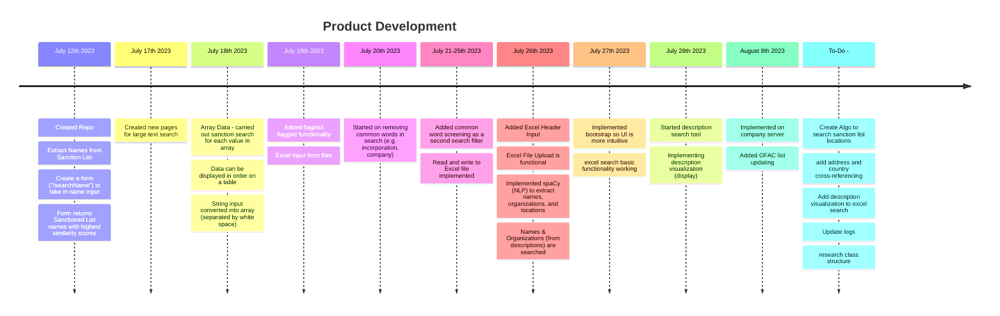

# sanctionlistchecker

Building a tool to check if companies/people within an uploaded Excel file are on the US Sanction list

# Product Breakdown
Sanction Search
-
The sanction search currently uses fuzzy matching and only references the **OFAC list (not updated)**.

Moving forward:
1. Referencing multiple sanction lists: US (OFAC), UN, EU, UK, etc.
2. Automatic updating of lists

Named Entity Recognition (Extraction from Descriptions)
-
Currently using spaCy's default English library to extract People/Names/Orgs out of descriptions to later be searched using the sanction search algorithm.

Moving forward:
1. Training custom dataset built from existing claims data and maybe the sanctions lists too.
2. Also update displacy visualization to only highlight searched terms and not all entities

Extra things to implement
-
1. Implement some kind of logging system to track searches
2. Updates page to reflect when new sanction lists have been updated
