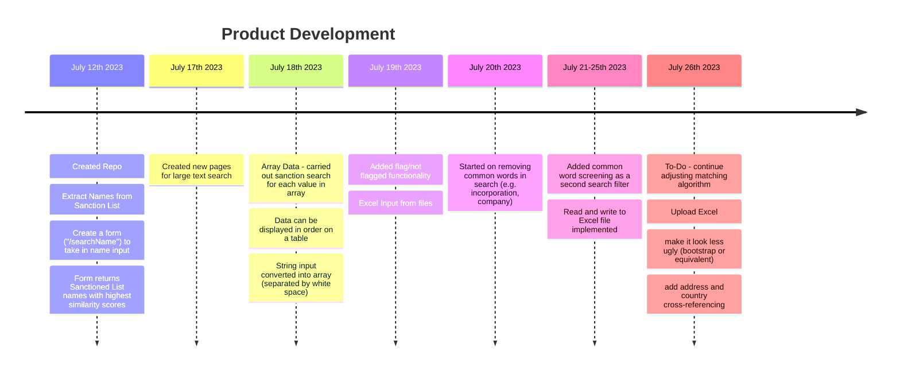

# sanctionlistchecker

Building a tool to check if companies/people are on the US Sanction list

```mermaid
timeline
    title Product Development
    July 12th 2023: Created Repo: Extract Names from Sanction List: Create a form ("/searchName") to take in name input: Form returns Sanctioned List names with highest similarity scores
    July 17th 2023: Created new pages for large text search
    July 18th 2023: Array Data - carried out sanction search for each value in array: Data can be displayed in order on a table: String input converted into array (separated by white space)
    July 19th 2023: Added flag/not flagged functionality: Excel Input from files
    July 20th 2023: Started on removing common words in search (e.g. incorporation, company)
    July 21-25th 2023: Added common word screening as a second search filter: Read and write to Excel file implemented
    July 26th 2023: To-Do - continue adjusting matching algorithm: Upload Excel: make it look less ugly (bootstrap or equivalent): add address and country cross-referencing
```
